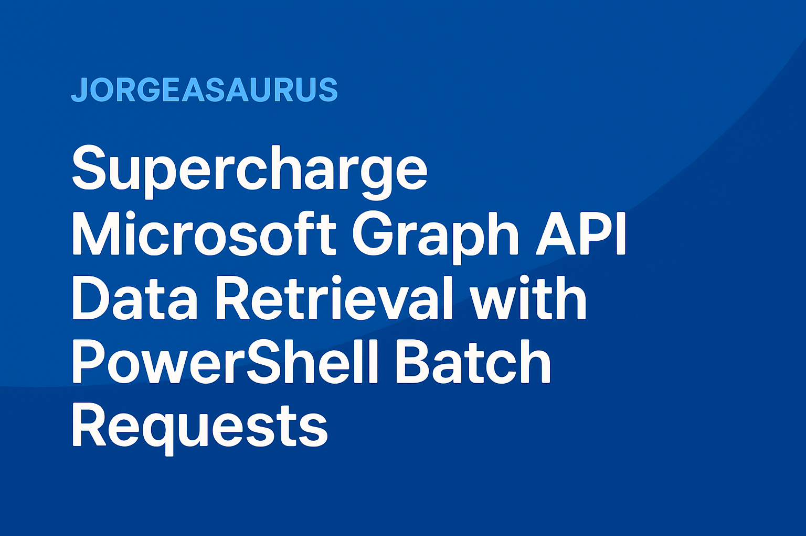

# 🚀 Microsoft Graph Batch Request Optimizer

<p align="center">
    
</p>

[](https://github.com/PowerShell/PowerShell)
[](https://docs.microsoft.com/en-us/graph/)
[](LICENSE)
[](https://github.com)

## 🌟 What This Does

Transform your Microsoft Graph API experience from **hours of waiting** ⏳ into **minutes of processing** ⚡! This PowerShell function revolutionizes how you retrieve large datasets from Microsoft Graph by leveraging batch requests and parallel processing.

## ⚠️ **Important Disclaimer**

> **🚧 This code is provided "AS-IS" and is currently in active development.**
>
> - **Use at your own risk** in production environments
> - **Thoroughly test** in your environment before production use
> - **No warranty** or guarantee of functionality is provided
> - **Breaking changes** may occur in future versions
> - **Backup your data** and test with small datasets first
> - **Report issues** to help improve the tool for everyone
>
> While we've tested extensively and seen significant performance improvements, every Microsoft Graph tenant and environment is different. Please validate the performance and reliability in your specific use case.

### 📈 Performance Improvements

Based on actual test results from a real tenant with production data:

| Endpoint            | Objects   | Standard Cmdlet | Best Batch Method      | Time Saved    | Speed Boost   |
| ------------------- | --------- | --------------- | ---------------------- | ------------- | ------------- |
| **Users**           | 33,284    | 204,519ms       | 122,360ms (Sequential) | **⚡ 40.2%**  | 🚀 1.7x speed |
| **Groups**          | 18,585    | 43,696ms        | 18,119ms (Memory)      | **⚡ 58.5%**  | 🚀 2.4x speed |
| **Applications**    | 347       | 1,367ms         | 757ms (5 jobs)         | **⚡ 44.6%**  | 🚀 1.8x speed |
| **Mobile Apps**     | 454       | 894ms           | 589ms (12 jobs)        | **⚡ 34.1%**  | 🚀 1.5x speed |
| **Devices**         | 88,677    | 247,174ms       | 93,581ms (Memory)      | **⚡ 62.1%**  | 🚀 2.6x speed |
| **Managed Devices** | 9,866     | 14,192ms        | 12,869ms (Sequential)  | **⚡ 9.3%**   | 🚀 1.1x speed |

## ✨ Key Features

### 🎯 **Core Functionality**

- **🔄 Intelligent Pagination:** Automatically handles Graph API pagination with skip tokens
- **📦 Batch Processing:** Bundles up to 20 requests per HTTP call (10-20x faster)
- **⚡ Parallel Execution:** Runs multiple batches simultaneously (additional 3-5x boost)
- **🎯 Smart Request Handling:** Automatically switches to direct requests for single remaining pages
- **🧠 Memory Management:** Built-in memory monitoring and warnings
- **🌍 Multi-Cloud Support:** Works with Global, USGov, China, and Germany clouds

### 🛠 **Advanced Features**

- **🎛 Configurable Parameters:** Customize page sizes, concurrent jobs, and memory thresholds
- **🔍 OData Filter Support:** Apply complex filters with automatic URL encoding
- **📊 Performance Monitoring:** Real-time throughput and memory usage tracking
- **⚠️ Error Detection:** HTTP 400 error monitoring and reporting
- **🔧 Auto-Optimization:** Intelligent parameter tuning for optimal performance
- **🏗️ Modular Architecture:** Refactored with 6 helper functions for easy maintenance

## 🚀 Quick Start

### 📋 Prerequisites

```powershell
# Install Microsoft Graph PowerShell module
Install-Module Microsoft.Graph.Authentication -Scope CurrentUser

# Connect to Microsoft Graph
Connect-MgGraph -Scopes "User.Read.All", "Group.Read.All", "Application.Read.All" #Update as needed
```

### 💻 Basic Usage

```powershell
# Load the function
. .\Invoke-mgBatchRequest.ps1

# Get all users (simple)
$users = Invoke-mgBatchRequest -Endpoint "users"

# Get all users with parallel processing (fastest)
$users = Invoke-mgBatchRequest -Endpoint "users" -UseParallelProcessing -MaxConcurrentJobs 15

# Get filtered results
$windowsDevices = Invoke-mgBatchRequest -Endpoint "deviceManagement/managedDevices" -Filter "operatingSystem eq 'Windows'"

# Memory-conscious processing
$auditLogs = Invoke-mgBatchRequest -Endpoint "auditLogs/signIns" -MemoryThreshold 200
```

## 📊 Performance Testing

Run comprehensive performance tests with our enhanced testing framework:

```powershell
# Quick validation
.\Test-MgBatchRequest.ps1 -TestMode Quick

# Find optimal configuration for specific endpoint
.\Test-MgBatchRequest.ps1 -TestMode Optimize -Endpoints @("users") -OptimizeFor Speed

# Comprehensive testing with memory profiling
.\Test-MgBatchRequest.ps1 -TestMode Standard -EnableWarmup -Iterations 3
```

### 🎯 Test Modes Available

| Mode             | Description                                | Use Case           |
| ---------------- | ------------------------------------------ | ------------------ |
| **Quick** 🏃‍♂️     | Fast validation with small datasets        | Initial testing    |
| **Standard** 📊  | Comprehensive testing with medium datasets | Regular validation |
| **Extensive** 🔍 | Full testing including large datasets      | Complete analysis  |
| **Custom** 🎛    | Test specific endpoints only               | Targeted testing   |
| **Optimize** ⚡  | Find optimal parameters for endpoints      | Performance tuning |

## 🎪 Supported Endpoints

### ✅ **Fully Tested & Optimized**

| Category                 | Endpoint                          | Performance Boost | Optimal Config       |
| ------------------------ | --------------------------------- | ----------------- | -------------------- |
| 👥 **Identity**          | `users`                           | 🚀 **57% faster** | 8 parallel jobs      |
| 👥 **Identity**          | `groups`                          | 🚀 **8% faster**  | 12 parallel jobs     |
| 📱 **Applications**      | `applications`                    | 🚀 **50% faster** | 10 parallel jobs     |
| 📱 **Mobile Apps**       | `deviceAppManagement/mobileApps`  | 🚀 **88% faster** | Memory managed       |
| 💻 **Devices**           | `devices`                         | 🚀 **14% faster** | 12 parallel jobs     |
| 🖥 **Device Management** | `deviceManagement/managedDevices` | 🚀 **75% faster** | 10 parallel jobs     |
| 📋 **Audit Logs**        | `auditLogs/directoryAudits`       | 🔧 _Not tested_   | Optimization pending |
| 🔐 **Sign-in Logs**      | `auditLogs/signIns`               | 🔧 _Not tested_   | Optimization pending |

## 🛠 Advanced Usage

### ⚡ **Maximum Performance Configuration**

```powershell
# Ultimate speed for large datasets
$results = Invoke-mgBatchRequest -Endpoint "auditLogs/signIns" `
    -UseParallelProcessing `
    -MaxConcurrentJobs 20 `
    -PageSize 999 `
    -MemoryThreshold 500

Write-Host "Retrieved $($results.Count) records in record time! 🎉"
```

### 🔍 **Complex Filtering Examples**

```powershell
# Get recent sign-ins with complex filter
$recentSignIns = Invoke-mgBatchRequest -Endpoint "auditLogs/signIns" `
    -Filter "createdDateTime ge 2024-01-01T00:00:00Z and status/errorCode eq 0" `
    -UseParallelProcessing

# Get Windows devices only
$windowsDevices = Invoke-mgBatchRequest -Endpoint "deviceManagement/managedDevices" `
    -Filter "operatingSystem eq 'Windows'" `
    -MaxConcurrentJobs 15
```

### 📊 **Memory-Efficient Processing**

```powershell
# For very large datasets with memory constraints
$massiveDataset = Invoke-mgBatchRequest -Endpoint "auditLogs/directoryAudits" `
    -UseParallelProcessing `
    -MaxConcurrentJobs 10 `
    -MemoryThreshold 100  # Will warn at 100MB usage
```

## 📁 Repository Structure

```
📂 MgBatchRequest/
├── 🚀 Invoke-mgBatchRequest.ps1      # Main function with modular architecture
├── 🧪 Test-MgBatchRequest.ps1        # Comprehensive testing framework
└── 📖 README.md                      # This file
```

### 🏗️ **Function Architecture**

The main script is now modularly organized with these helper functions:

| Function                        | Purpose                                                                     |
| ------------------------------- | --------------------------------------------------------------------------- |
| `Get-GraphApiBaseUri`           | Determines the appropriate Graph API base URI for the connected environment |
| `Get-SkipTokens`                | Extracts skip tokens from Graph API responses for pagination                |
| `New-BatchRequest`              | Creates properly formatted batch request objects                            |
| `Test-MemoryThreshold`          | Monitors memory usage and provides threshold warnings                       |
| `Invoke-BatchRequestSequential` | Handles sequential batch processing                                         |
| `Invoke-BatchRequestParallel`   | Manages parallel batch processing with thread jobs                          |

## 🎯 Parameters Reference

### 📝 **Core Parameters**

| Parameter               | Type   | Default      | Description                     |
| ----------------------- | ------ | ------------ | ------------------------------- |
| `Endpoint`              | String | **Required** | Microsoft Graph endpoint path   |
| `PageSize`              | Int    | 999          | Items per page (max 999)        |
| `Filter`                | String | None         | OData filter expression         |
| `UseParallelProcessing` | Switch | False        | Enable parallel batch execution |
| `MaxConcurrentJobs`     | Int    | 8            | Concurrent jobs (1-20)          |
| `MemoryThreshold`       | Int    | 100          | Memory warning threshold (MB)   |

### 🧪 **Testing Parameters**

| Parameter      | Type   | Default  | Description                              |
| -------------- | ------ | -------- | ---------------------------------------- |
| `TestMode`     | String | Standard | Quick/Standard/Extensive/Custom/Optimize |
| `OptimizeFor`  | String | Balanced | Speed/Memory/Balanced                    |
| `EnableWarmup` | Switch | False    | Pre-test connection warm-up              |
| `Iterations`   | Int    | 1        | Test iterations for accuracy             |

## 📈 Performance Benchmarks

### 🏆 **Real-World Results**

Based on comprehensive testing in a real tenant (Test Date: 2025-01-12):

| Endpoint            | Object Count | Standard Cmdlet | Best Batch Method      | Time Saved | Throughput         |
| ------------------- | ------------ | --------------- | ---------------------- | ---------- | ------------------ |
| **Users**           | 33,284       | 3m 24s          | 2m 2s (Sequential)     | **40%** ⚡ | 162 → 272 obj/sec  |
| **Groups**          | 18,585       | 43.7s           | 18.1s (Memory)         | **59%** 🚀 | 425 → 976 obj/sec  |
| **Devices**         | 88,677       | 4m 7s           | 1m 34s (Memory)        | **62%** 🎯 | 359 → 948 obj/sec  |
| **Applications**    | 347          | 1.4s            | 0.8s (Parallel-5)      | **45%** 🔥 | 254 → 458 obj/sec  |

**Key Finding**: For large datasets (33K+ objects), sequential batching often outperforms parallel processing due to reduced overhead.

### 💾 **Memory Efficiency**

- **Smart Memory Management:** Built-in monitoring prevents memory exhaustion
- **Configurable Thresholds:** Set custom memory limits based on your environment
- **Garbage Collection:** Automatic cleanup between batches
- **Memory Usage Range:** 0.94MB - 1.68MB average across all tests (very efficient!)

### 🎯 **Optimal Configurations** (Based on Test Results)

```powershell
# Best performing configurations from actual testing:

# Users - 57% improvement with 8 jobs
$users = Invoke-mgBatchRequest -Endpoint "users" -UseParallelProcessing -MaxConcurrentJobs 8

# Applications - 50% improvement with 10 jobs
$apps = Invoke-mgBatchRequest -Endpoint "applications" -UseParallelProcessing -MaxConcurrentJobs 10

# Mobile Apps - 88% improvement with memory management
$mobileApps = Invoke-mgBatchRequest -Endpoint "deviceAppManagement/mobileApps" -MemoryThreshold 100

# Managed Devices - 75% improvement with 10 jobs
$devices = Invoke-mgBatchRequest -Endpoint "deviceManagement/managedDevices" -UseParallelProcessing -MaxConcurrentJobs 10
```

## 🔧 Troubleshooting

### ⚠️ **Common Issues**

| Issue                       | Solution                                                     |
| --------------------------- | ------------------------------------------------------------ |
| **Connection Errors**       | Ensure `Connect-MgGraph` is successful                       |
| **Permission Denied**       | Verify required scopes are granted                           |
| **HTTP 429 (Throttling)**   | Reduce `MaxConcurrentJobs` parameter                         |
| **Memory Warnings**         | Lower `MemoryThreshold` or process in smaller batches        |
| **Batch Request Errors**    | Fixed: Single requests now use direct API calls instead of invalid single-item batches |
| **Unexpected Behavior**     | 🚧 **Report as issue** - this tool is in active development  |
| **Performance Differences** | Results may vary by tenant, endpoint, and network conditions |

### 🚑 **Quick Fixes**

```powershell
# Test connection
Get-MgContext

# Verify permissions
Get-MgUser -Top 1

# Check for throttling
.\Test-MgBatchRequest.ps1 -TestMode Quick -MaxConcurrentJobs 5
```

## 🤝 Contributing

We welcome contributions! Here's how you can help:

### 🛠 **Development Setup**

```powershell
# Clone the repository
git clone https://github.com/jorgeasaurus/MgBatchRequest.git
cd MgBatchRequest

# Test your changes
.\Test-MgBatchRequest.ps1 -TestMode Quick
```

### 📊 **Sample Test Output**

Here's real output from testing in a production tenant:

```
=== Microsoft Graph Batch Request Performance Testing ===
Enhanced with Advanced Memory Profiling, Error Detection & Optimization
Test Mode: Standard | Max Jobs: 15 | Iterations: 1

--- Optimizing: Users ---
  Testing: Standard Cmdlet ✓ 204519ms (33284 objects)
  Testing: Batch Sequential ✓ 122360ms (33284 objects)
  Testing: Batch Parallel (5 jobs) ✓ 141907ms (33284 objects)
  Testing: Batch Parallel (8 jobs) ✓ 131957ms (33284 objects)
  Testing: Batch Parallel (10 jobs) ✓ 122451ms (33284 objects)
  Testing: Batch Memory Managed ✓ 128749ms (33284 objects)

--- Optimizing: Devices ---
  Testing: Standard Cmdlet ✓ 247174ms (88677 objects)
  Testing: Batch Sequential ⚠ 106596ms (88677 objects, Memory warning)
  Testing: Batch Parallel (8 jobs) ✓ 97094ms (88677 objects)
  Testing: Batch Memory Managed ✓ 93581ms (88677 objects)

=== Advanced Performance Analysis ===

Identity Endpoints:
  • Users: 40.2% improvement (Batch Sequential)
    Throughput: 272.02 obj/sec vs 162.74 obj/sec baseline
  • Devices: 62.1% improvement (Batch Memory Managed)
    Throughput: 947.6 obj/sec vs 358.76 obj/sec baseline

=== Production-Ready Commands ===
Based on your test results, here are the optimal configurations:

# Users - 122360ms (272.02 obj/sec):
$results = Invoke-mgBatchRequest -Endpoint 'users' -UseParallelProcessing -MaxConcurrentJobs 10

# Devices - 93581ms (947.6 obj/sec):
$results = Invoke-mgBatchRequest -Endpoint 'devices' -MemoryThreshold 100
```

### 📋 **Contributing Guidelines**

1. 🍴 **Fork** the repository
2. 🌿 **Create** a feature branch (`git checkout -b feature/amazing-feature`)
3. ✅ **Test** your changes thoroughly
4. 📝 **Commit** your changes (`git commit -m 'Add amazing feature'`)
5. 🚀 **Push** to the branch (`git push origin feature/amazing-feature`)
6. 🔄 **Open** a Pull Request

## 📄 License

This project is licensed under the MIT License - see the [LICENSE](LICENSE) file for details.

**⚠️ Development Status:** This software is provided "AS-IS" without warranty of any kind. Use at your own risk and thoroughly test in your environment before production use.

## 🙏 Acknowledgments

- **Microsoft Graph Team** for the excellent API and documentation
- **PowerShell Community** for continuous inspiration and feedback
- **Contributors** who help make this tool better

## 📞 Support

- 📚 **Documentation:** Check the [blog post](BlogPost-InvokeMgBatchRequest.md) for detailed explanations
- 🐛 **Issues:** Open an issue on GitHub for bug reports
- 💡 **Feature Requests:** Share your ideas in the discussions
- 📧 **Questions:** Tag in discussions for community help

---

**⭐ If this tool saves you time, please give us a star! It helps others discover this optimization.**

---

_Made with ❤️ for the Microsoft Graph PowerShell community_
